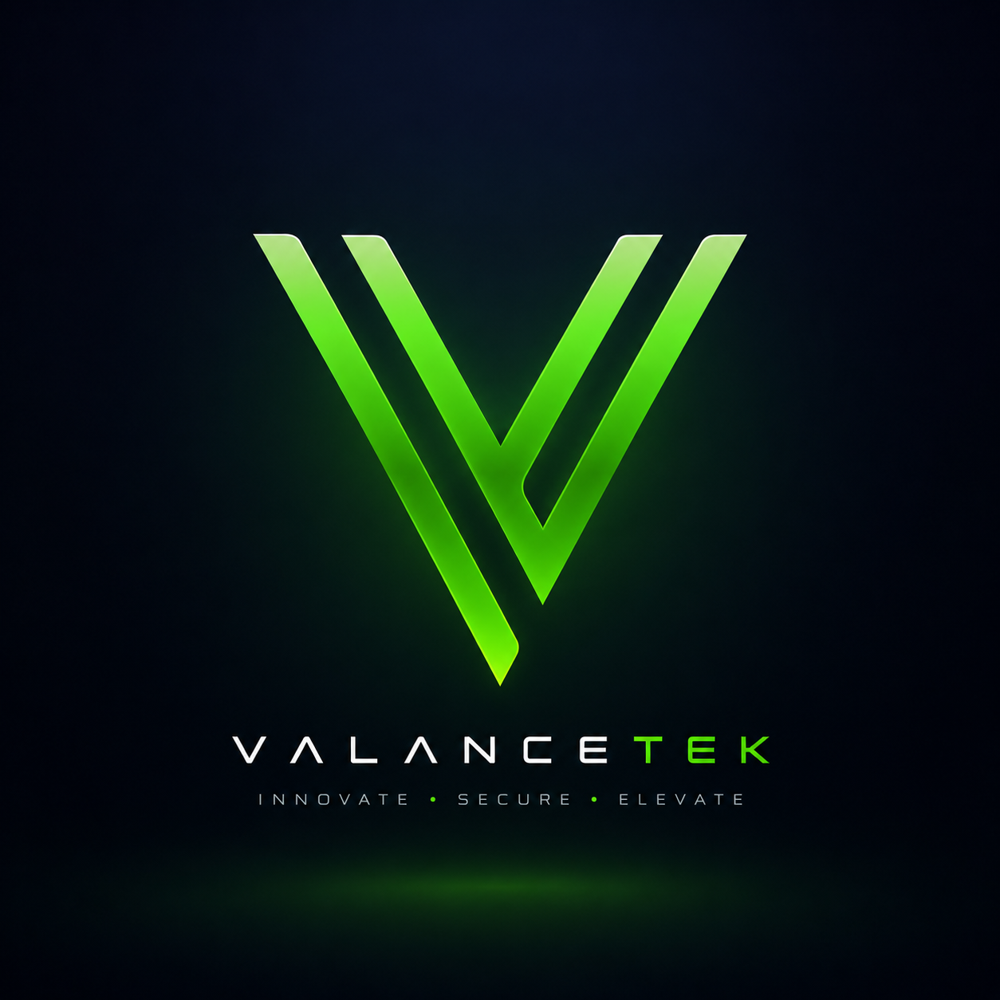
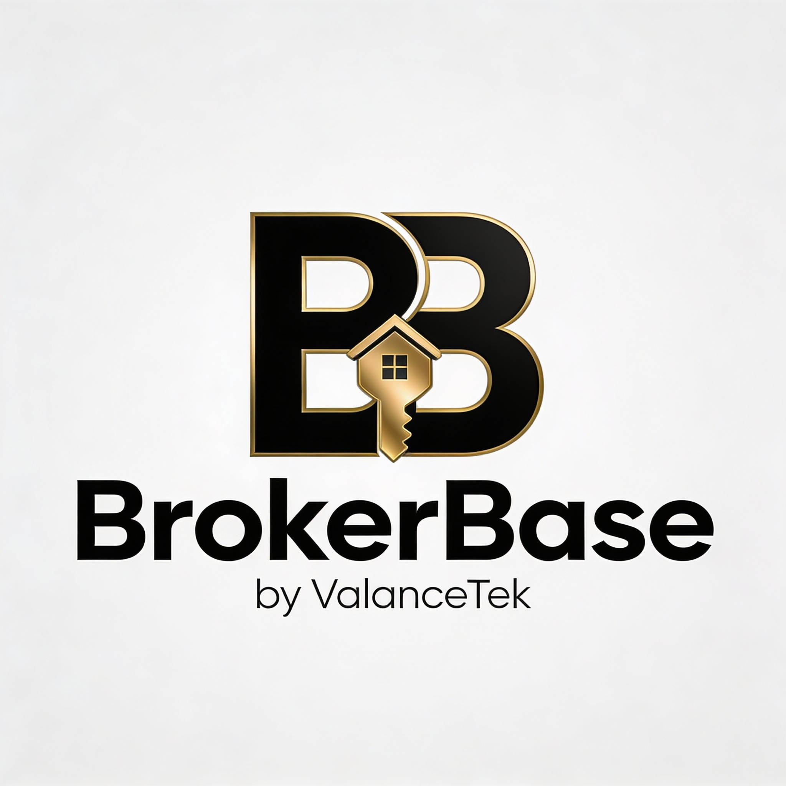

  
  
  
  
  
  <h1>Tanishq Khatri</h1>
  <h4>🚀 Data Analyst | Open Source Enthusiast</h4>
  
Founder of Valance Tek | Lifelong Learner

---

I'm a builder and a lifelong learner who thrives outside the traditional classroom. I believe in hands-on learning and applying new knowledge every single day. I'm currently founding [Valance Tek]("https://github.com/ValanceTek") to amplify my impact and support the open-source ecosystem.

I maintain a balanced lifestyle focused on improving my health, expanding my knowledge, growing my business, and connecting with others. Off the keyboard, I'm either traveling, hitting the badminton court, or playing games on Steam. 

## 🏞️ Interests

- 🏸 Playing badminton 
- 🎮 Multiplayer games
- 🌍 exploring the world
- 💡  new tech & hands-on learning
- 🤝 Open-source contributions & networking
---
<!--
## 💡 Motto

> I love open source and I contribute in my free time! --> 
